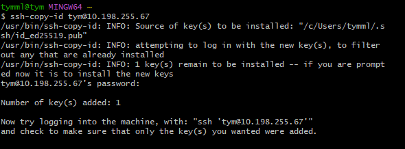
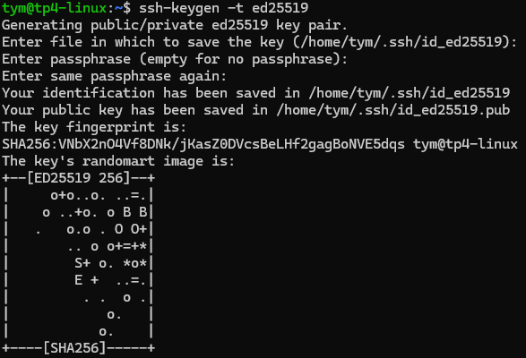
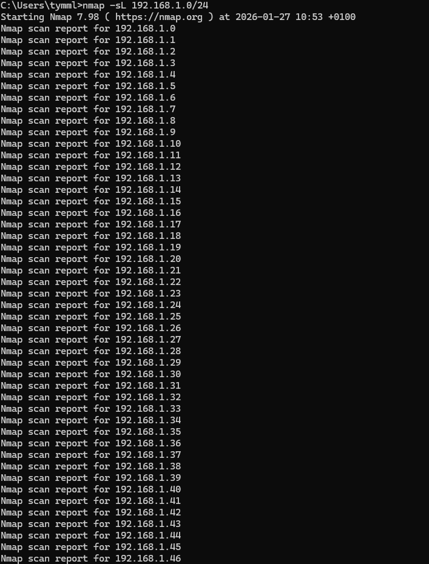

# I. Exploration locale en solo
## 1. Affichage d'informations sur la pile TCP/IP locale

### 1-A) Infos des cartes réseau du PC: 

commande necessaire : ` ipconfig /all `

#### Interface WiFi
- nom : Carte réseau sans fil Wi-Fi
- adresse MAC : C0-A5-E8-A9-15-50
- adresse IP : 10.33.69.158

#### Interface Ethernet
- nom : Carte Ethernet vEthernet
- adresse MAC : 00-15-5D-CE-D5-97
- adresse IP : 172.29.176.1

### 1-B) Calcul adresse réseau/broadcast:

####  Calcul adresse réseaux:
- carte wifi : 10.33.64.0
- carte ethernet : 172.29.0.0

#### Calcul adresse broadcast
- carte wifi : 10.33.79.255
- carte ethernet : 172.29.255.255

### 1-C) afficher gateway:

 Passerelle par défaut (gateway) : 10.33.79.254

### 1-D) En GUI, trouvez comment afficher les informations sur une carte IP:

chemin : Parametres/réseau wifi et internet/ wifi/ propriétés réseau wifi(nom du réseau)

 QUESTION : A quoi sert la gateway dans le réseau d'Ingésup ? 

La gateway dans le réseau d’Ingésup permet a un PC de sortir du réseau local.
Elle envoie les données vers Internet ou d’autres réseaux et applique les règles de sécurité.

## 2. Modifications des informations

### 2-A) Modification d'adresse IP - pt. 1

#### calcule la première et la dernière IP disponibles du réseau : 

Si on enleve l'adresse réseaux(X.X.X.0) et l'adresse broadcast(X.X.X.255), on a donc comme première adresse disponible X.X.X.1 et comme dernière X.X.X.254 en masque /24

#### Changer l'adresse IP de la carte WiFi pour une autre

chemin : paramètres réseau → Wi-Fi → Attribution d'adresse IP → manuel

### 2-B) nmap

#### Utilisez nmap pour scanner le réseau de votre carte WiFi et trouver une adresse IP libre

1 - Commande pour le réseau Ingésup ` nmap -sn -PE 192.168.1.0/24`

résultat : `Nmap done: 256 IP addresses (0 hosts up) scanned in 53.44 seconds`

2 - Pour trouver le "nom" associés aux adresses IP : `nmap -sL 192.168.1.0/24` 

résultat : 

