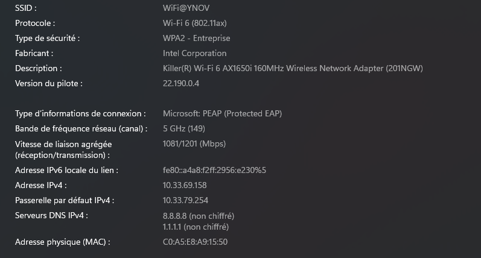
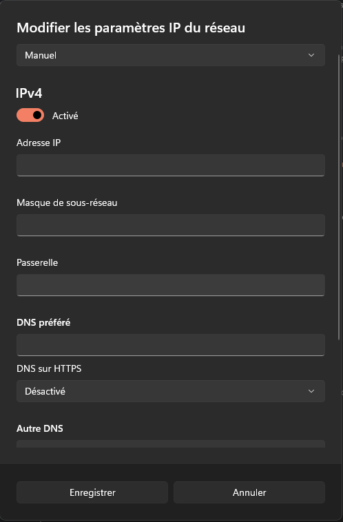
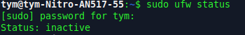
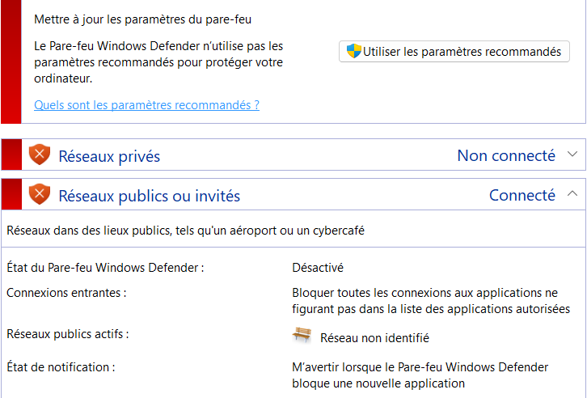
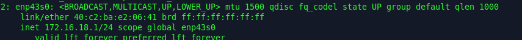
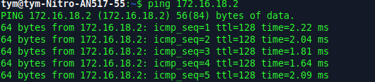
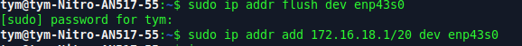
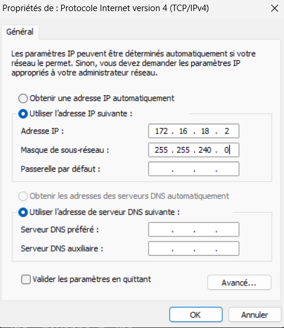
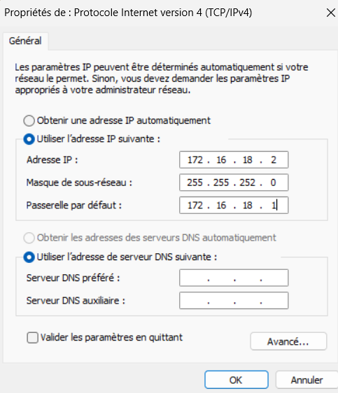

# I. Exploration locale en solo
## 1. Affichage d'informations sur la pile TCP/IP locale

### 1-A) Infos des cartes réseau du PC: 

commande necessaire : ` ipconfig /all `

#### Interface WiFi
- nom : Carte réseau sans fil Wi-Fi
- adresse MAC : C0-A5-E8-A9-15-50
- adresse IP : 10.33.69.158

#### Interface Ethernet
- nom : Carte Ethernet vEthernet
- adresse MAC : 00-15-5D-CE-D5-97
- adresse IP : 172.29.176.1

### 1-B) Calcul adresse réseau/broadcast:

####  Calcul adresse réseaux:
- carte wifi : 10.33.64.0
- carte ethernet : 172.29.0.0

#### Calcul adresse broadcast
- carte wifi : 10.33.79.255
- carte ethernet : 172.29.255.255

### 1-C) afficher gateway:

 Passerelle par défaut (gateway) : 10.33.79.254

### 1-D) En GUI, trouvez comment afficher les informations sur une carte IP:

chemin : Parametres/réseau wifi et internet/ wifi/ propriétés réseau wifi(nom du réseau)



 QUESTION : A quoi sert la gateway dans le réseau d'Ingésup ? 

La gateway dans le réseau d’Ingésup permet a un PC de sortir du réseau local.
Elle envoie les données vers Internet ou d’autres réseaux et applique les règles de sécurité.

## 2. Modifications des informations

### 2-A) Modification d'adresse IP - pt. 1

#### calcule la première et la dernière IP disponibles du réseau : 

Si on enleve l'adresse réseaux(X.X.X.0) et l'adresse broadcast(X.X.X.255), on a donc comme première adresse disponible X.X.X.1 et comme dernière X.X.X.254 en masque /24

#### Changer l'adresse IP de la carte WiFi pour une autre

chemin : paramètres réseau → Wi-Fi → Attribution d'adresse IP → manuel



### 2-B) nmap

#### Utilisez nmap pour scanner le réseau de votre carte WiFi et trouver une adresse IP libre

1 - Commande pour le réseau Ingésup ` nmap -sn -PE 192.168.1.0/24`

résultat : `Nmap done: 256 IP addresses (0 hosts up) scanned in 53.44 seconds`

2 - Pour trouver le "nom" associés aux adresses IP : `nmap -sL 192.168.1.0/24` 

résultat : 


### 2-C) Modification d'adresse IP

Depuis Parametres/réseau wifi et internet/ wifi/ propriétés réseau wifi(nom du réseau) : on change manuellement l'IP et la gateway et on peux ensuite se connecter a internet

Attention : L’adresse choisie appartient au même réseau et n’apparaît pas parmi les hôtes actifs détectés, ce qui évite tout conflit d’adresses IP


# II. Exploration locale en duo

- meme reseau et ss reseau et desac pare feux deux pc ufw 
- pc1 : 192.168.10.1 (wifi) 
- pc2 : 192.168.10.2 -> gateway pc1 ip
- regle nat carte wifi (Network manager) masquerade 

## 1. Prérequis

- 2 PC avec des firewall désactivés : 
    - 1 sous linux (connecté au wifi):

    

    - 1 sous windows : 

    

- connection par cable rj45

## 2. Câblage 


## 3. Modification d'adresse IP
### A) Modifiez l'IP des deux machines pour qu'elles soient dans le même réseau
- sur linux :



- sur windows : 


### B) Utilisez ping pour tester la connectivité entre les deux machines

- Pour linux :



- Pour windows :

 
### C) Testez avec d'autres masques

- Avec un masque /20 : 
     
    
    

    - ping : 

    

- plus petit masque possible (/30): 
    

    

    - ping  : 

    

## 4. Utilisation d'un des deux comme gateway

### A) PC sans wifi : définir comme passerelle l'adresse IP de l'autre PC



### B) Sur Linux, faites le en ligne de commande


### C) Un ping 8.8.8.8 qui fonctionne sur un PC sans carte WiFi.


## 5. Petit chat privé 

(pour celui ci j'ai fait entre deux terminal sur mon pc linux car le deuxieme pc sous windows n'acceptais pas l'installation de netcat )

Apres l'installation de Netcat on fait :

- dans le terminal 1 : ``` nc -l -p 8888```

- dans le terminal 2 : ```nc 172.16.18.1 8888 ```


