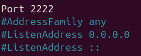
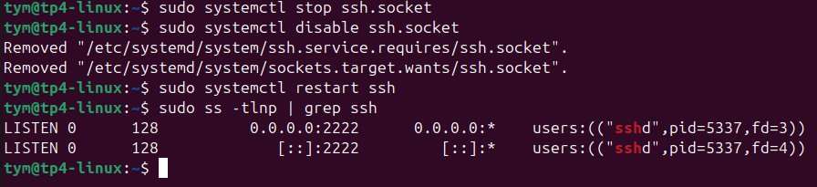
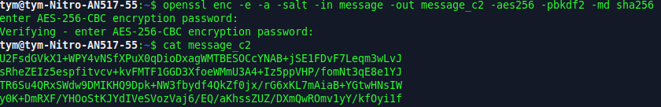

#  I. Exploration en solo
## 1. Base64

### A) Comparer la taille des fichiers



On remarque que file_bin_b64 est plus volumineux de 18 135 octets que file_bin

### B) Les fichiers binaires sont-ils identiques ?


## 2. AES (Chiffrement symétrique)
### A) CRYPTAGE
Apres la commande ``` cat /usr/share/dict/words | grep ker  | tr "\n" " " >message``` on obtient un enorme texte.


et pour le crypter on fait 

### B) DÉCRYPTAGE

En utilisant la commande ```openssl enc -d -in message_c -aes256 -pbkdf2 -md sha256``` il y a deux possibilité: 

- on se trompe de mot de passe :


- on met le bon mot de passe : 


### C) CAT

En faisant ```cat message_c``` on obtient 

### D) Encoder base64

```openssl enc -e -a -salt -in message -out message_c2 -aes256 -pbkdf2 -md sha256```
Cette commande permet de crypter en base 64



## 3. RSA (Chiffrement asymétrique)

### A) Générez une paire de clés RSA de 2048 bits

Commande : ``` openssl genrsa -out cle_ynov.pem 2048``` 