#  I. Exploration en solo
## 1. Base64

### A) Comparer la taille des fichiers

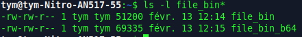

On remarque que file_bin_b64 est plus volumineux de 18 135 octets que file_bin

### B) Les fichiers binaires sont-ils identiques ?

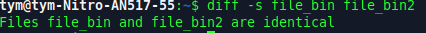

## 2. AES (Chiffrement symétrique)
### A) CRYPTAGE
Apres la commande ``` cat /usr/share/dict/words | grep ker  | tr "\n" " " >message``` on obtient un enorme texte.

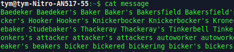

et pour le crypter on fait 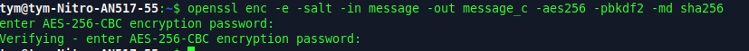

### B) DÉCRYPTAGE

En utilisant la commande ```openssl enc -d -in message_c -aes256 -pbkdf2 -md sha256``` il y a deux possibilité: 

- on se trompe de mot de passe :

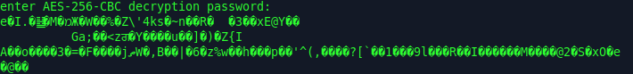

- on met le bon mot de passe : 

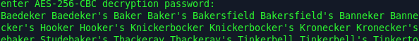

### C) CAT

En faisant ```cat message_c``` on obtient 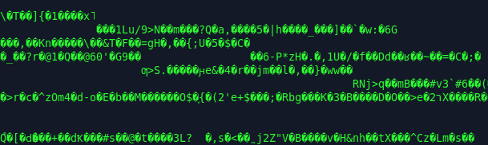

### D) Encoder base64

```openssl enc -e -a -salt -in message -out message_c2 -aes256 -pbkdf2 -md sha256```
Cette commande permet de crypter en base 64


## 3. RSA (Chiffrement asymétrique)

### A) Générez une paire de clés RSA de 2048 bits

Commande : ``` openssl genrsa -out cle_ynov.pem 2048``` 

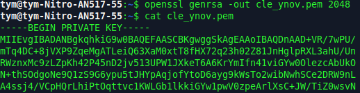

### B) Paramètres clé

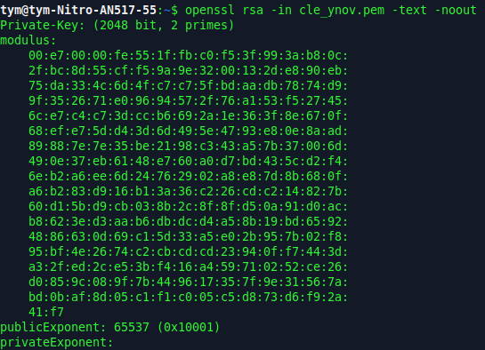

### C) Protéger la paire de clés RSA avec un chiffrement AES


### D) Que pouvons nous voir dans ces paramètres ?

Dans les paramètres affichés, on voit :

- la taille de la clé

- le modulus (n)

- l’exposant public (exponent)

- il n'y a aucune donnée privée

### E) Créer une passphrase avec vim ou nano

Avec ```nano pass_ynov ```


Ensuite on chiffre la passphrase avec la clé publique et on la déchiffre après: 


# II. Sans que je vous file les réponses à chaques étapes

## 1. Base64

### A) Génération d’un fichier binaire

Commande : ``` dd if=/dev/urandom of=data.bin bs=1024 count=100 ```


### B) Encodage

Commande : ```base64 data.bin > data.b64```

Pour afficher sons contenue on fait ``` cat data.b64``

Le fichier data.b64 est bien plus volumineux que data.bin

### C) Décodage


### D) Questions

1. La base64 est un encodage, pas un chiffrement car elle n'utilise aucune clé et toute personne peut décoder facilement.
2. En base64 on transforme 3 octets en 4 caractères ASCII et ces 4 caractères occupes 4 octets de stockage
3. Un fichier de 100Ko passe a environs 130Ko donc une ogmentation d'environs 33%
4. La méthode la plus fiable est le hachage cryptographique soit ``` sha256sum fichier1 fichier2``` sous linux

## 2. Chiffrement symétrique – AES

### A) Création d’un message

Commande : ``` nano confidentiel.txt ```

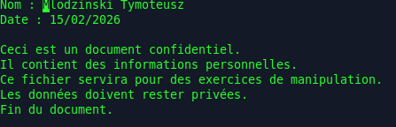

### B) Chiffrement


vÉrification binaire: 


### C) Déchiffrement


### D)  Analyse

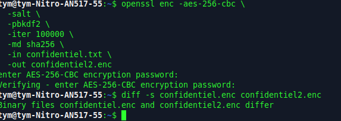

### E)  Questions

1. Le sel est aléatoire à chaque chiffrement. Le sel modifie la clé générée à partir du mot de passe donc le chiffrement est différent
2. Le sel est une donnée aléatoire ajoutée au début du chiffrement qui rend unique la clé dérivée du mot de passe
3. La clé dérivée du mot de passe ne sera pas la même donc le déchiffrement échouera
4. Transforme un mot de passe en clé cryptographique sécurisée et effectue un grand nombre d’itérations pour ralentir les attaques par force brute

## 3. Cryptographie asymétrique – RSA

### A) Génération de clés

- Générer paire de clé : 

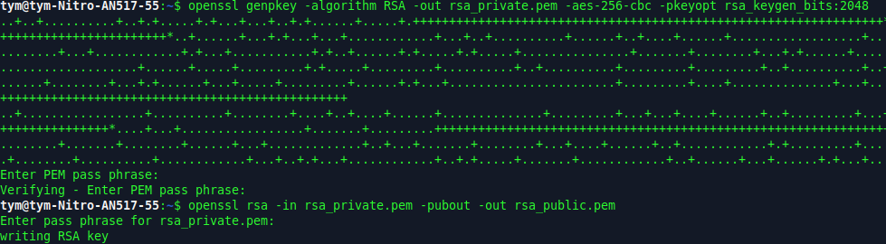

- Paramètres clé privé : 

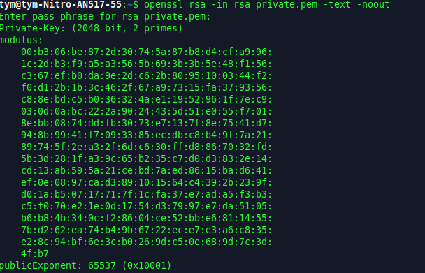

- Paramètres clé public : 

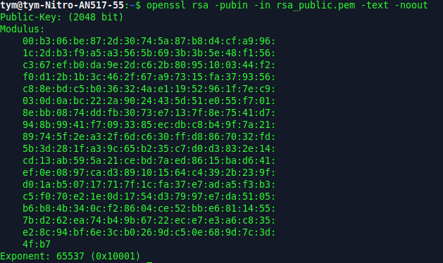

- Comparaison : 

    - La clé privée contient : Tous les paramètres (n, e, d, p, q, dp, dq, qinv) → permet de déchiffrer ou signer

    - La clé publique contient : Seulement n et e → permet de chiffrer ou vérifier une signature

### B)  Chiffrement asymétrique

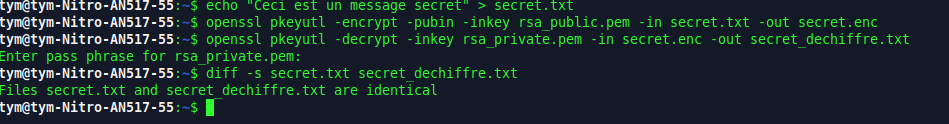


### C) Questions

1. Si elle est partagée tout le monde peut déchiffrer les messages qui t’étaient destinés et on peut usurper ton identité(signer des documents en ton nom.)
2. RSA repose sur des calculs mathématiques coûteux. Pour un gros fichier le temps de calcul devient énorme.
3. La clé privée contient d (secret) alors que la clé publique contient e (non secret). Sans d, il est quasi impossible de retrouver le message d’origine.
4. Il définit l’espace des nombres utilisés pour le chiffrement/déchiffrement et assure que les opérations d’exponentiation restent réversibles et limitées à un domaine fini.
5. Avantages :

    - Performance : AES est rapide pour de gros fichiers.

    - Sécurité : RSA protège la clé AES.

    - Fexibilité : une seule clé RSA peut être utilisée pour partager la clé AES avec plusieurs destinataires.

##  3. Signature numérique

### A) Création et signature

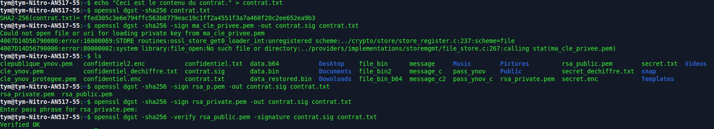

### B) Vérification

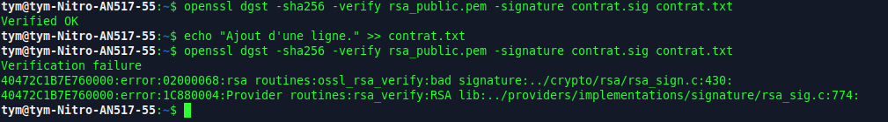

### C) Questions

1. Après avoir modifié contrat.txt la vérification de la signature échoue. La signature correspond à l’empreinte (hash) du fichier original. 
2. Si le fichier change, son hash change aussi. La signature ne correspond donc plus à ce nouveau hash.
3. Il sert à résumer le fichier en un petit nombre fixe de bits et a rendre le processus efficace
4. Le chiffrement protège la confidentialité d’un message en le rendant illisible pour les autres, tandis que la signature numérique garantit son authenticité et son intégrité en prouvant qu’il vient bien de l’expéditeur et n’a pas été modifié.