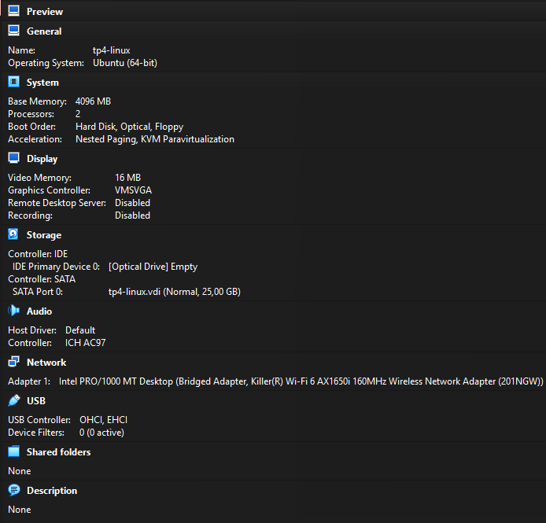
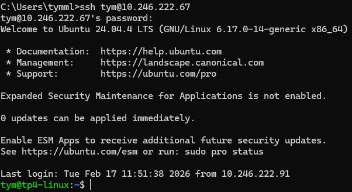

# TP – Administration SSH et Serveur Web Nginx

## Partie 1 – Mise en place de l’environnement virtualisé
### 1 - Créez une VM Ubuntu

### 2 - Vérifiez que la VM a une IP accessible depuis la machine hôte

## Partie 2 – Serveur SSH

### 1 - Installez le serveur SSH sur la VM.

### 2 - Vérifiez que le service SSH fonctionne et écoute sur un port.

### 3 - Connectez-vous depuis la machine hôte 

