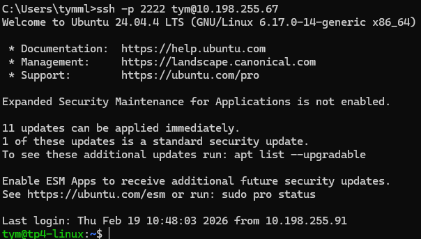

# TP – Administration SSH et Serveur Web Nginx

## Partie 1 – Mise en place de l’environnement virtualisé
### 1 - Créez une VM Ubuntu


### 2 - Vérifiez que la VM a une IP accessible depuis la machine hôte


## Partie 2 – Serveur SSH

### 1 - Installez le serveur SSH sur la VM.


### 2 - Vérifiez que le service SSH fonctionne et écoute sur un port.


### 3 - Connectez-vous depuis la machine hôte 


### 4 - Générez une clé SSH sur la machine cliente


### 5- Copier clé ssh


### 6 - Teste connection sans mot de passe


## Partie 3 – Sécurisation SSH

Commande : ``` sudo nano /etc/ssh/sshd_config ```

### 1 - Interdisez l’accès root.


###  2 - Désactivez l’authentification par mot de passe.


### 3 - Modifier le port 


### 4 - Testez la connexion avec le nouveau port




## Partie 4 – Transfert de fichiers
### 1 - Transférez un fichier


