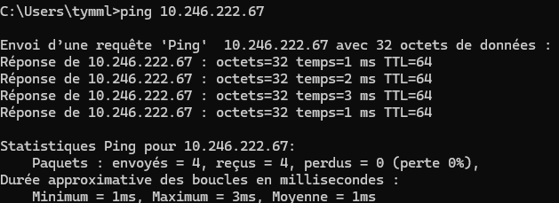
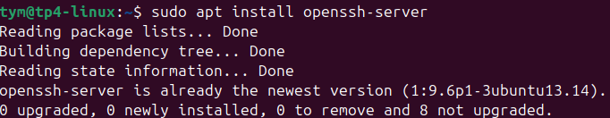
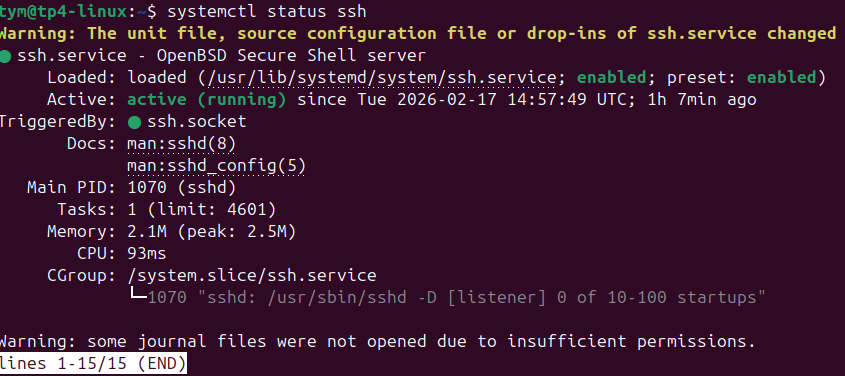
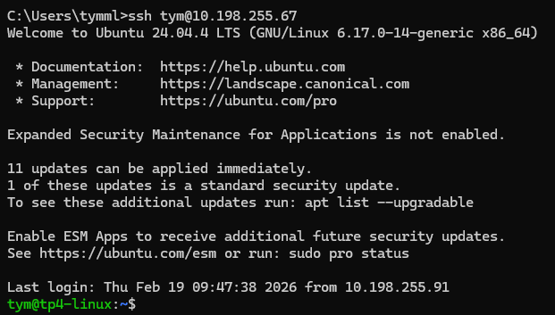
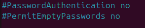
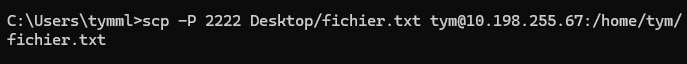
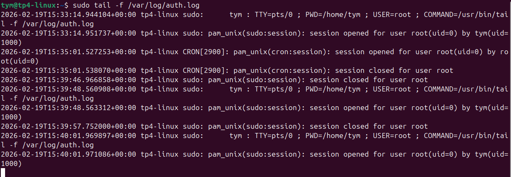

# TP – Administration SSH et Serveur Web Nginx

## Partie 1 – Mise en place de l’environnement virtualisé
### 1 - Créez une VM Ubuntu


### 2 - Vérifiez que la VM a une IP accessible depuis la machine hôte



## Partie 2 – Serveur SSH

### 1 - Installez le serveur SSH sur la VM.



### 2 - Vérifiez que le service SSH fonctionne et écoute sur un port.



### 3 - Connectez-vous depuis la machine hôte 


### 4 - Générez une clé SSH sur la machine cliente


### 5- Copier clé ssh


### 6 - Teste connection sans mot de passe



## Partie 3 – Sécurisation SSH

Commande : ``` sudo nano /etc/ssh/sshd_config ```

### 1 - Interdisez l’accès root.


###  2 - Désactivez l’authentification par mot de passe.


### 3 - Modifier le port 




### 4 - Testez la connexion avec le nouveau port


## Partie 4 – Transfert de fichiers
### 1 - Transférez un fichier


### 2 - Transférez un dossier



## Partie 5 – Analyse des logs et sécurité
### 1 - Suivez les logs d’authentification


### 2 - Installez Fail2Ban et testez un bannissement


Commande :
```
sudo apt update
sudo apt install fail2ban
sudo systemctl status fail2ban
sudo nano /etc/fail2ban/jail.local

dedans mettre:

[sshd]
enabled = true
port = 2222
logpath = /var/log/auth.log
maxretry = 3
bantime = 600

sudo systemctl restart fail2ban

```

## Partie 6 – Tunnel SSH

Tout d'abord il faut installer apache2 avec la commande ``` sudo apt insatall apache2```

Puis lancer le tunnel avec ```ssh -p 2222 -L 8080:localhost:80 tym@10.198.255.67``

 