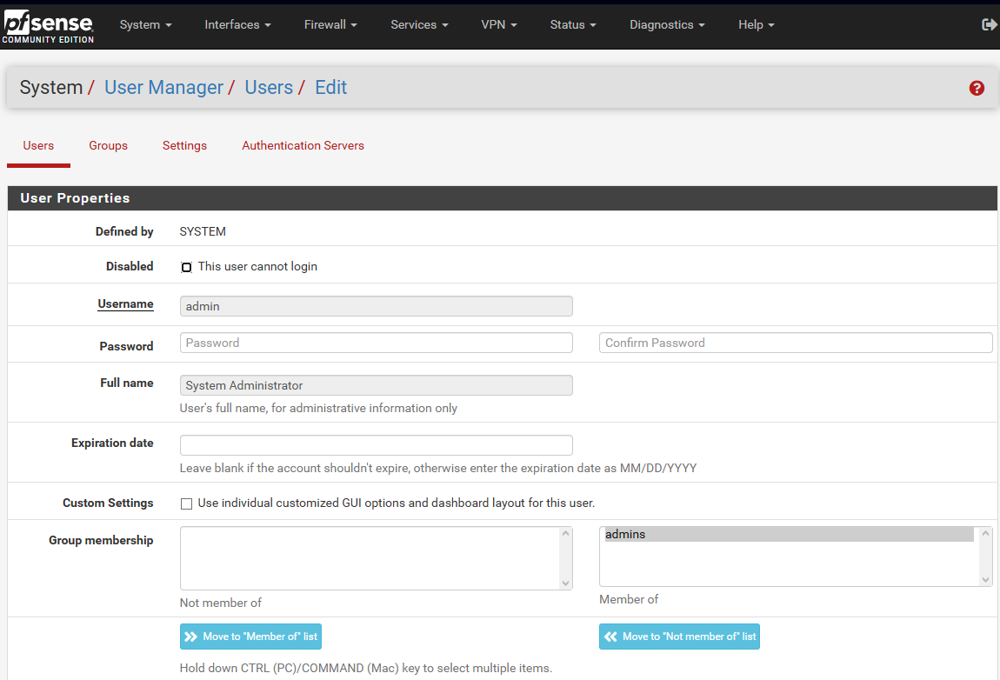
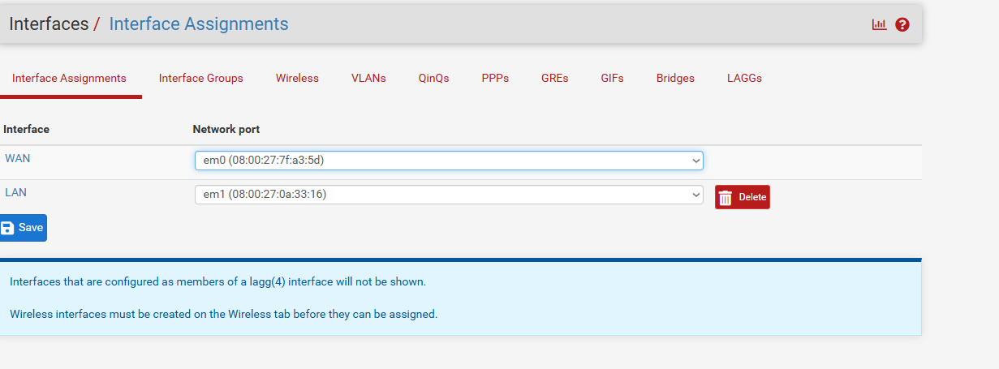

# TP5 : pfSense – Bases d’un pare-feu

## Partie 1 – Prise en main et sécurisation
### 1. Accès à l’interface

### 1-A) Quelle est l’adresse IP du LAN 

En LAN, pfSense utilise l'IP 192.168.56.100

### 1-B) Quelle est l’adresse IP du WAN

L'adresse IP du WAN est 10.0.2.15

### 1-C) Pourquoi utilise-t-on HTTPS

On utilise HTTPS pour ajouter une sécurité la communication entre un serveur et un client. HTTPS garentie la sécurité et l'integrité du client.

### 1-D) Pourquoi faut-il changer les identifiants par défaut sur un pare-feu ?

Ne pas changer les identifiants par défaut sur un pare-feu comporte de nombreux risques:

- Ils sont publics et connus : un pirate test toujours les identifiants par défaut
- Cible des attaques automatiques
- Risque de compromission totale du réseau : espionnage de trafic, installation de règles malveillantes, internet coupé ...

### 2. Sécurisation de l’accès administrateur



### 2-A) Où se gèrent les utilisateurs

Dans l'interface web on va dans ```systeme -> User Manager```. ON peut modifier les informations des utilisateurs présent ou encore ajouter d'autres utilisateurs.

### 2-B) Qu’est-ce qu’un mot de passe robuste

Un mot de passe robuste contient en générale tout type de caractères:

- plus de 12 charactères
- majuscules et miniscules
- chiffres
- caractères spéciaux
Dans un mot de passe robuste il faut éviter de mettre des informations personnelles tel que une date d'anniversaire ...

### 2-C) Pourquoi sécuriser en priorité l’accès admin sur un équipement réseau

Car l'admin peut :

- Modifier les règles de firewall
- Ouvrir ou fermer des ports
- Créer des VPN
- Espionner le trafic
- Supprimer des protections

## Partie 2 – Comprendre les interfaces réseau

### 3. Vérification des interfaces



### 3-A) Quelle interface permet l’accès Internet

C'est l'interface WAN(Wide Area Network) qui permet cet accès.

### 3-B) Quelle interface correspond au réseau interne

C'est l'interface LAN(Local Area Network)

### 3-C) Que se passerait-il si les interfaces étaient inversées

Il y a plusieurs possibilités :

- Le réseau interne serait exposé directement à Internet
- Les postes clients pourraient ne plus avoir accès à Internet
- Les règles de sécurité ne fonctionneraient plus correctement
- Risque majeur de compromission du réseau

## Partie 3 – Configuration des services réseau

### 4. DHCP

### 4-A) Pourquoi utiliser DHCP plutôt qu’une IP fixe


### 4-B) Quelle plage d’adresses choisir


### 4-C) Quelles adresses faut-il éviter d’inclure dans la plage

