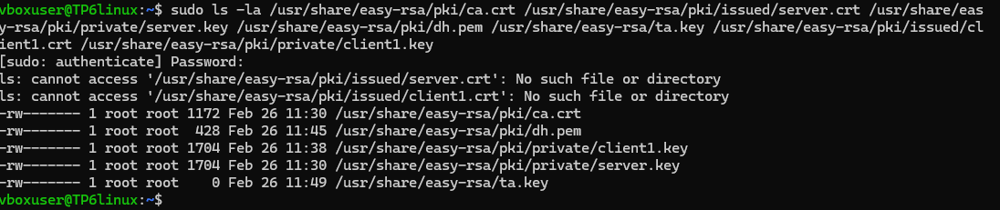

# TP6 - Mise en place d'un serveur OpenVPN sur Ubuntu Server

## Partie 1 : Comprendre la PKI

### 1-A) À quoi sert une autorité de certification

Une autorité de certification est un tiers de confiance qui vérifie l’identité d’une entité avant de lui délivrer un certificat numérique.

### 1-B) Quelle différence entre clé privée et certificat

La clé privée est un secret gardé sur la machine ou par l’utilisateur, qui sert à déchiffrer des données chiffrées avec la clé publique correspondante

### 1-C) Pourquoi un serveur VPN a-t-il besoin de certificats

Le serveur VPN utilise un certificat pour prouver à un client qu’il est bien le bon serveur et empêcher un attaquant de se faire passer pour lui

## Création de l'infrastructure Easy-RSA

### 2) Créer un environnement PKI


### 3-A) Où Easy-RSA crée-t-il ses fichiers ?

Easy-RSA crée tous ses fichiers dans le sous-dossier pki/ du répertoire courant où on lances ./easyrsa

### 3-B) Que contient le dossier pki/ ?

- ca.crt : certificat public de la CA

- private/ : clés privées (ca.key, server.key, client1.key)

- issued/ : certificats signés (server.crt, client1.crt)

- reqs/ : demandes CSR non signées

- dh.pem : paramètres Diffie-Hellman

- index.txt et serial : base de données des certificats

### 3-C) Quelle est la différence entre gen-req et sign-req ?

gen-req crée la clé privée + une demande de signature (CSR) non signée. sign-req signe cette demande avec la CA pour créer un certificat valide.

### 3-D) Que se passe-t-il si vous oubliez de signer un certificat ?

Le certificat n'est pas valide. OpenVPN refuse la connexion avec l'erreur "certificate not trusted" et "TLS key negotiation failed".


## Partie 2 : Configuration du serveur OpenVPN

### 4-A) Que signifie dev tun ?

dev tun crée un tunnel de niveau 3 (IP/routage). Les paquets IP sont encapsulés dans le tunnel VPN.

### 4-B) Quelle est la différence entre UDP et TCP pour un VPN ?

- UDP : Plus rapide, moins de latence. Idéal pour la plupart des usages (vidéo, jeux). Port 1194 par défaut.

- TCP : Plus fciable (réessaie les paquets perdus). Utile derrière des firewalls stricts ou proxies. Port 443 (HTTPS-like).

### 4-C) Quelle plage IP choisir pour le VPN ? Pourquoi ?


## Routage et NAT

### 5-A) Où se configure le paramètre ip_forward ?

Dans /etc/sysctl.conf. Ajoute ou décommente net.ipv4.ip_forward=1, puis sudo sysctl -p.

### 5-B)Quelle commande permet d'afficher les règles NAT actuelles ?

La commmande ```sudo iptables -t nat -L -v -n```

### 5-C) Pourquoi faut-il "masquerader" le réseau VPN ?

Pour que les clients VPN sortent sur Internet avec l'adresse IP publique du serveur (NAT). Sans ça, leurs paquets arrivent avec une IP privée non routable et sont rejetés par Internet.

## Démarrage et analyse du service


### 6-A) Quelle commande permet d'afficher les logs système d'un service ?

```sudo journalctl -u openvpn-server@server -xe```

### 6-B) Quelle est la différence entre status et journalctl ?

- status : état résumé + dernières 10 lignes de log

- journalctl : tous les logs du service (scroll complet, filtres temporels)

### 6-C) Les chemins vers les certificats sont-ils corrects ?


## Partie 3 : Création du profil client

### 7-A) Comment intégrer un certificat directement dans un fichier .ovpn ?

```
<ca>
-----BEGIN CERTIFICATE-----
[contenu ca.crt]
-----END CERTIFICATE-----
</ca>

<cert>
[contenu client.crt]
</cert>

<key>
[contenu client.key]
</key>

<tls-auth>
[contenu ta.key]
</tls-auth>

```

### 7-B) Pourquoi la clé privée ne doit-elle jamais être partagée publiquement ?

Quiconque a la clé privée peut :

- Se faire passer pour le propriétaire du certificat

- Déchiffrer tout le trafic chiffré avec la clé publique correspondante

- Signer de faux messages/certificats au nom du propriétaire
C'est l'équivalent d'un mot de passe maître pour l'identité numérique.


## Tests et validation

### Comment vérifier que votre trafic passe par le VPN ?


### Que se passe-t-il si le port 1194 est bloqué ?